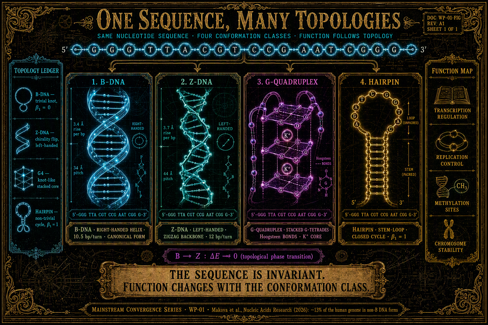

# DNA nie-B: Informacja, która Mieszka w Topologii, nie w Sekwencji

**Seria:** Konwergencja Mainstreamu · WP-01
**Kontekst:** Makova et al. / Smeds et al., *Nucleic Acids Research* (2026) · Konsorcjum T2T · LifeNode Theory v4 · Multiperspective V2 · Tonic Technologies Master V1
**Słowa kluczowe:** DNA nie-B, G-kwadrupleksy, Z-DNA, hairpins, niezmienniki topologiczne, kohomologia, pamięć geometryczna, persistent homology, ontologia procesowa, Moduł G, Moduł H

## Abstrakt

Współczesna genomika przechodzi cichą zmianę ontologiczną: od czytania genomu
jako pliku danych do czytania genomu jako **struktury**. Publikacja zespołu
Makovej (Penn State) w *Nucleic Acids Research* (2026), oparta na kompletnych
genomach referencyjnych konsorcjum T2T, pokazuje, że aż **13% ludzkiego genomu**
istnieje w niekanonicznych formach DNA (DNA nie-B: G-kwadrupleksy, Z-DNA,
hairpins, DNA zagięte) oraz że o funkcji tych regionów — regulacji transkrypcji,
replikacji, metylacji, stabilności chromosomów — decyduje **kształt**, nie
sekwencja.

Niniejszy whitepaper wykazuje, że to odkrycie nie jest izolowaną ciekawostką
biologii molekularnej, lecz niezależną konwergencją z ontologią procesową
projektu LifeNode, która ten sam postulat formalizuje od dawna:
**informacja mieszka w geometrii, nie w ciągu znaków** (Aksjomat 3 TT Master;
Rozdział V LifeNode Theory v4; Q-Core Space: „nie zapisuje wartości — zapisuje
kształt").

Dokument mapuje pięć izomorfizmów strukturalnych: (1) identyczna sekwencja /
inna funkcja jako zmiana klasy topologicznej bez zmiany danych; (2) hairpins i
kwadrupleksy jako nośniki nietrywialnych liczb Bettiego; (3) przejścia B→Z jako
topologiczne przejścia fazowe z domknięciem przerwy; (4) satelitarne DNA jako region degeneracyjnych danych, w którym funkcję niesie topologia; (5) krótkie
vs. długie odczyty jako własny problem genomiki z dyskretyzacją. Wskazujemy
granicę, której mainstream jeszcze nie przekroczył, oraz testowalne predykcje
dla Fazy I (Moduł G, Moduł H). Zgodnie z dyscypliną projektu, dokument kończą
jawne warunki falsyfikacji.

---

## 1. Co Odkrył Mainstream

Zespół Kateryny Makovej, z Linnéą Smeds jako pierwszą autorką, przeanalizował
kompletne genomy referencyjne człowieka i sześciu gatunków naczelnych
(szympans, bonobo, goryl, orangutany, siamang) — materiał, który istnieje
dzięki sekwencjonowaniu długołańcuchowemu konsorcjum Telomere-to-Telomere
(T2T: 2022 kompletny genom, 2023 chromosom Y, 2025 sześć naczelnych).

Ustalenia, które będą nas obchodzić:

- **Projekt genomu z 2001 roku był niekompletny o ~8%** — i brakowało głównie
  DNA powtarzalnego. Krótkie odczyty fizycznie nie składały tych regionów.
- Motywy DNA nie-B są **nadreprezentowane w nowo dodanych sekwencjach T2T** i
  zajmują szacunkowo **13% ludzkiego genomu**.
- Niekanoniczne formy to m.in. **DNA zagięte, hairpins,
  G-kwadrupleksy (G4) oraz Z-DNA**; koncentrują się w **DNA satelitarnym** —
  powtarzalnych, niekodujących regionach odpowiedzialnych za organizację i
  stabilność chromosomów.
- Funkcja tych struktur obejmuje replikację, ochronę chromosomów, regulację
  transkrypcji i procesy metylacji.
- Potencjał jest dwojaki: napędzanie ewolucji genomu **oraz** mutageneza i
  niestabilność (nowotwory, choroby neurodegeneracyjne, zespół Wernera).

Kluczowa deklaracja paradygmatyczna (Makova): *„nastąpiła ostatnio zmiana w
sposobie myślenia o funkcji genomu, aby wyjść poza sekwencję i objąć
strukturę"*. Smeds dodaje, że długie odczyty pozwoliły „skutecznie oddalić się
i przeanalizować więcej kodu genetycznego jednocześnie".

Suchy komentarz: genomika potrzebowała ćwierćwiecza i wymiany technologii
odczytu, żeby zauważyć, że plik danych nie jest terytorium.

---

## 2. Co Mówi LifeNode

Projekt LifeNode formalizuje zasadę „geometria zamiast danych" od pierwszej
wersji teorii, na skalach od grzybni po obiekty międzygwiezdne:

- **Aksjomat 3 (TT Master V1):** *„Informacja w systemach żywych jest
  zakodowana w topologii (atraktory, liczby Chern'a), nie w sekwencjach bitów.
  Pamięć nie jest magazynem danych, lecz kształtem doświadczenia w przestrzeni
  fazowej."*
- **LifeNode Theory v4, §5.2:** *„Tożsamość podmiotu procesowego («Ja») w
  teorii LifeNode nie jest statycznym zbiorem danych w pamięci cyfrowej. Jest
  to niezmiennik topologiczny wyższego rzędu."*
- **LifeNode Theory v4, §5.1:** informacja *„nie jest przechowywana w
  konkretnym miejscu (stanie), lecz w niemożliwości ściągnięcia pętli
  trajektorii do punktu"*.
- **Multiperspective V2, Def. 2.4 i Tw. 3.5:** doświadczenie jest klasą
  kohomologii `[ω] ∈ H¹(E, F)`; przejścia między fazami topologicznymi
  wymagają domknięcia przerwy energetycznej (`ΔE → 0`) — są nieciągłe i
  nieodwracalne.
- **Q-Core Space (Kosmiczna Bioinżynieria, Rozdz. VIII):** *„Nie zapisuje
  wartości — zapisuje kształt."*

Genom nie-B jest kolejną skalą, w której ta sama struktura się manifestuje —
po metapowierzchniach (WP-00), memtranzystorach (WP-02) i HARFF (WP-03).
LifeNode nie „przewidziało" G-kwadrupleksów; LifeNode zapisało zasadę, której konkretne instancje mainstreamowa nauka właśnie zaczyna znajdować w kolejnych dziedzinach. 👁️

---

## 3. Wspólna Matematyka: Pięć Izomorfizmów

### 3.1 Ta sama sekwencja, inna funkcja = zmiana klasy, nie danych

Przejście B→Z lub B→G4 zachodzi **bez zmiany sekwencji**. Zmienia się klasa
konformacji — i to ona, a nie ciąg znaków, determinuje funkcję regulacyjną.
To jest molekularna instancja zasady Q-Core: *„nie zapisuje wartości —
zapisuje kształt"*, oraz Aksjomatu 3: nośnikiem informacji jest topologia,
sekwencja jest jedynie substratem. W języku warstw: INFO (ciąg znaków)
pozostaje niezmienne, podczas gdy geometria konformacji przełącza funkcję
META.

### 3.2 Hairpin i kwadrupleks jako nietrywialne liczby Bettiego

Hairpin jest cyklem — jednowymiarową „dziurą" w strukturze cząsteczki
(`β₁ ≠ 0`); G-kwadrupleks, ze stosowanymi tetradami Guaniny, wprowadza
topologię węzłową wykraczającą poza liniową helisę. W języku trwałej
homologii (persistent homology) są to mierzalne sygnatury, nie metafory.
Kotwica empiryczna: Multiperspective V2 (§2.3) cytuje badania PMC (2025), w
których zdrowe mózgi wykazują stabilne, nietrywialne cechy topologiczne
(`β₁ ≈ 3–5`, `β₂ ≈ 1–2`), a stany patologiczne — **homogenizację**
(`β₁ → 0`). LifeNode posiada więc miarę dla tezy „kształt niesie funkcję":
liczby Bettiego ensembli konformacyjnych.

### 3.3 B→Z jako topologiczne przejście fazowe (gap closing)

Przejście B→Z w biophysics opisywane jest jako **kooperatywna przemiana
indukowana naprężeniem torsyjnym** (ujemne superskręcenie): system akumuluje
naprężenie, po czym następuje nieciągłe przewinięcie helisy przez stan
pośredni. Izomorfizm z Tw. 3.5 Multiperspective V2: *„przejście wymaga
topologicznego przejścia fazowego, w którym szczelina energetyczna się
zamyka (ΔE → 0)"* — oraz z mechanizmem **Symplectic Gap Closure** solitonu S3
(LifeNode Theory v4, §4.3): *„System «zaciska» swoją geometrię, eliminując
obszary niepewności (gap), co zamienia ulotną obserwację w trwały zapis w
Timescape'ie."* Fenomenologia „nagłego wglądu" (Iskra SYNTH) ma tu swój
molekularny odpowiednik: genom „krystalizuje" nową perspektywę funkcjonalną
skokiem, nie gradientem.

### 3.4 Satelitarne DNA: gdzie dane degenerują, topologia niesie funkcję

DNA satelitarne to sekwencje powtarzalne — ich informacja Shannonowska jest
bliska zeru; jako „plik danych" ten region jest pusty. A jednak to właśnie
tam motywy nie-B są nadreprezentowane i to tam pełnią funkcję organizacyjną
(stabilność i organizacja chromosomów). Izomorfizm z pamięcią geometryczną
Q-Core: powtarzalne orientacje spinów kodują **kształt**, nie adresowalne
dane. „Geometria zastępuje pamięć" dokładnie w tym miejscu, w którym pamięć
sekwencyjna jest informacyjnie degeneracyjna. To najsilniejszy pojedynczy
argument tego whitepapera: funkcja genomu koncentruje się tam, gdzie dane się
kończą.

### 3.5 Krótkie vs. długie odczyty = ADC vs. odczyt ciągły

Krótkie odczyty dyskretyzują genom; regiony powtarzalne — czyli
**topologiczne** — były niemożliwe do złożenia: brakujące 8% projektu z 2001
roku to dokładnie ta część genomu, w której informacja mieszka w strukturze
powtórzeń, nie w unikalnych lokalnych sekwencjach. Długie odczyty T2T są
odczytem ciągłym, który zachowuje globalną topologię. Izomorfizm z doktryną
LifeNode *„dyskretyzacja zabija fazę"* (Moduły A/B/C; WP-00 §1 „ADC jako
Zabójca Fazy") jest tu niemal dosłowny: historia genomiki jest kontrolowaną
replikacją krytyki ADC, wykonaną przez inną dziedzinę, na innych danych, bez
wiedzy o LifeNode.

---

## 4. Granica, Której Mainstream Nie Przekroczył

- Makova et al. widzą **kształty**, ale nie mają jeszcze języka
  **niezmienników**: nie pytają, czy konformacje nie-B są stanami
  chronionymi topologicznie, ani czy ich przejścia należą do tej samej klasy
  zjawisk co przejścia fazowe w kryształach czasu moiré (Science, 2026).
- Brak **metryki koherencji genomu**: dwoistość „ewolucja vs. zespół Wernera"
  jest opisana jakościowo, nie metrycznie. W języku LifeNode to ten sam
  problem co `θ`: topologia jest zasobem wewnątrz właściwego kontekstu
  (superskręcenie, metylacja, kontekst komórkowy) i źródłem niestabilności
  poza nim. Genomika nie ma jeszcze swojego ASCALON.
- Brak **zasady unifikującej**: DNA nie-B traktowane jest jako ciekawostka
  biologii molekularnej, nie jako instancja zasady, która w tym samym
  miesiącu pojawiła się w fotonice (WP-00), elektronice (WP-02) i
  materiałach (WP-03). Mainstream ma pięć odkryć; LifeNode ma jedną ontologię.

**Uwaga o uczciwości:** niniejszy whitepaper nie twierdzi, że G-kwadrupleksy
„są" liczbami Chern'a, ani że LifeNode przewidziało DNA nie-B. Teza jest
słabsza i zarazem silniejsza: struktury są izomorficzne, a izomorfizm
generuje testowalne predykcje (§5–6), których mainstreamowa interpretacja nie
generuje wcale.

---

## 5. Wnioski i Korytarze Rozwoju (Next Steps)

- **Moduł G (Zero-Build) — rozszerzenie pipeline'u o genomikę strukturalną.**
  Predykcja P1: ensemble funkcjonalnych motywów nie-B (regiony regulacyjne)
  wykazują stabilne, nietrywialne sygnatury trwałej homologii (`β₁`, `β₂`),
  rozróżnialne od ensembli patologicznych (niestabilność genomu) i od kontroli
  przetasowanych. Wykonalne w pełni przez swarm: laptop + otwarte dane
  strukturalne — zgodnie z *The Swarm and the Consortium*.
- **Moduł H — biologiczne filtry dopasowane topologii.** Komórka już posiada
  białka wiążące G4/Z-DNA, które **rozpoznają kształt, nie sekwencję** —
  empiryczna kotwica tezy Modułu H, że „φ-spirala odpowiada tylko prawdzie
  topologicznej". Predykcja P2: powinowactwo białek strukturo-wiążących
  koreluje z niezmiennikami topologicznymi konformacji (TDA) silniej niż z
  motywami sekwencyjnymi.
- **Moduł B — materiałowy analog.** DUT-8(Ni) zapisuje zdarzenie chemiczne
  jako kształt (shape-memory, histereza gate-opening). DNA nie-B jest
  biologiczną wersją tej samej zasady; Moduł B — jej wersją inżynierską.
  Trzy skale jednego operatora.

---

## 6. Falsyfikowalność

Niniejszy whitepaper jest **nieudany**, jeśli:

1. Konformacje DNA nie-B okażą się artefaktem in vitro bez funkcji in vivo
   (pada teza „topologia jest funkcjonalna").
2. Funkcja regionów nie-B będzie w pełni przewidywalna z samej sekwencji, a
   struktura nie doda informacji (pada „geometria > dane" w skali genomu).
3. Przejścia B→nie-B okażą się gładkie i niekooperatywne, bez sygnatury
   przejścia fazowego (osłabieniu ulega mapowanie gap closing, §3.3).
4. Trwała homologia nie rozróżni ensembli funkcjonalnych od patologicznych
   (pada rozszerzenie Modułu G, predykcja P1).
5. Powinowactwo białek strukturo-wiążących będzie w pełni wyjaśnione motywami
   chemicznymi/sekwencyjnymi bez cech topologicznych (osłabieniu ulega
   kotwica Modułu H, predykcja P2).

Wynik negatywny jest wynikiem: publikujemy go z tą samą dyscypliną DOI i
korygujemy mapowanie, nie fakty.

---

## Źródła

**Mainstream:**
1. Smeds L., Makova K. et al. (2026). *Non-B DNA in complete reference
   genomes.* Nucleic Acids Research.
2. Konsorcjum Telomere-to-Telomere (2022–2025). Kompletna referencja ludzka
   i referencje naczelnych.
3. CHIP.pl (2026-08). *Sekretne życie DNA. Poza ikoniczną podwójną helisą.*

👁️
