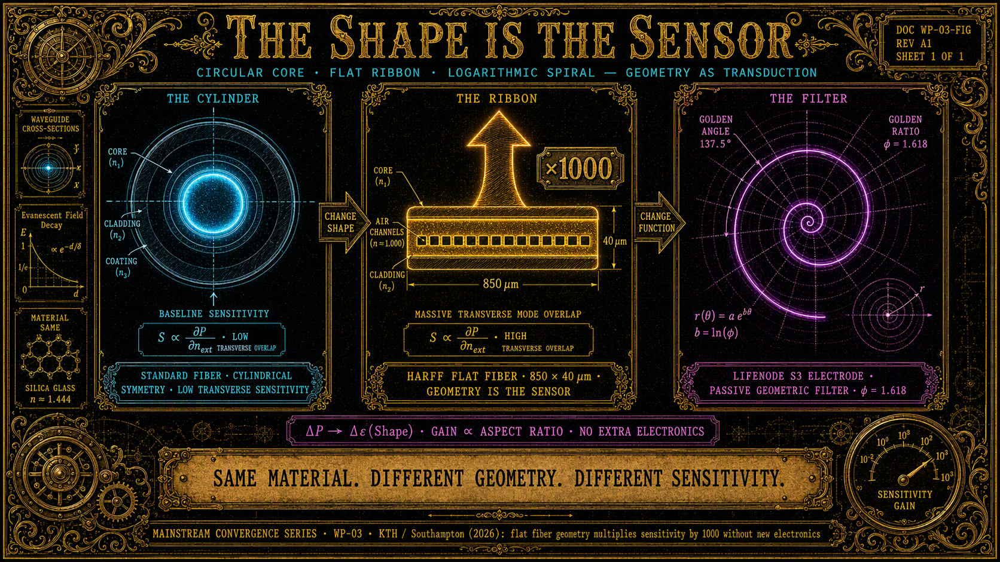

# HARFF: Sensing, które Mieszka w Geometrii, nie w Elektronice

**Seria:** Konwergencja Mainstreamu · WP-03
**Kontekst:** KTH Royal Institute of Technology / University of Southampton (2026) · LifeNode Phase 1 (Moduły A, H, F) · Tonic Technologies Master V1 · Kosmiczna Bioinżynieria, Rozdz. VII · WP-00
**Słowa kluczowe:** HARFF, płaski światłowód, obliczenia morfologiczne, filtr geometryczny, spirala logarytmiczna S3, impedancja Finslera, Living Walls, Moduł A, Moduł H

## Abstrakt

Zespół KTH Royal Institute of Technology i University of Southampton
opublikował platformę HARFF (High Aspect-Ratio Flat Fiber) — krzemionkowy
światłowód o przekroju 850 × 40 μm, którego czułość na ciśnienie jest
**o trzy rzędy wielkości (×1000) wyższa** od porównywanych konstrukcji
opartych na okrągłym włóknie — **bez żadnej zmiany elektroniki**. Cały
zysk mieszka w przekroju. To nie jest jedyna funkcja: ten sam kawałek
szkła jest jednocześnie czujnikiem ciśnienia, temperatury i naprężeń —
obserwable wybiera **geometria kanałów i wypełnień**, nie nowe obwody.

Niniejszy whitepaper wykazuje, że to nie jest ciekawostka fotoniki, lecz
niezależna konwergencja z zasadą, którą LifeNode zapisuje od Modułu A:
**morfologia jest obliczeniem**. Spirala logarytmiczna elektrod S3 jako
pasywny filtr geometryczny (Moduł A), „powierzchnia rozpoznaje przez
geometrię" (Moduł H), impedancja Finslera Living Walls zależna od stanu
metabolicznego (Kosmiczna Bioinżynieria, Rozdz. VII) — to ta sama teza,
której HARFF dostarcza inżynierskiej instancji w domenie materiałów:
„kształt przestaje być opakowaniem czujnika; kształt jest bezpośrednio
częścią samego czujnika".

Dokument mapuje pięć izomorfizmów: (1) funkcja przenoszenia zapisana w
przekroju; (2) ×1000 jako zysk geometryczny, nie energetyczny; (3) jeden
substrat, wiele obserwabli; (4) wewnętrzne kanały jako program materiału;
(5) nerw w kompozycie — granica systemu jako jego własny czujnik.
Wskazujemy granicę, której mainstream nie przekroczył (geometria zamrożona
vs. geometria żywa), oraz testowalne predykcje dla Modułów A, H i F.
Zgodnie z dyscypliną serii, dokument kończą jawne warunki falsyfikacji.

---

## 1. Co Odkrył Mainstream

Zespół KTH / Southampton, HARFF (High Aspect-Ratio Flat Fiber), 2026:

- **Płaski światłowód krzemionkowy:** ~850 μm szerokości, ~40 μm
  grubości — czworokątny przekrój o wysokim współczynniku kształtu.
- **Nie walec po przejściach:** to nie jest okrągłe włókno spłaszczone
  walcem. Płaski kształt zaprojektowano od zera i uzyskano procesem
  łączącym metodę *stack-and-draw* z laserową obróbką szkła. Wytworzono
  **ponad 100 metrów** włókna — to nie jest laboratoryjny artefakt
  z jednego zdjęcia.
- **Kanały wewnętrzne:** w strukturze można tworzyć kanały powietrzne,
  a później wypełniać je innymi materiałami. Kanał wypełniony stopem na
  bazie cyny daje czujnik temperatury: szkło i metal rozszerzają się
  inaczej, różnicowa ekspansja tworzy naprężenia odczytywane optycznie.
- **×1000:** w laboratoryjnym demonstratorze czułość na ciśnienie była
  nawet o **trzy rzędy wielkości wyższa** od porównywanych konstrukcji
  z okrągłym włóknem. Okrągłe włókno dobrze czuje naprężenia wzdłuż osi,
  słabo poprzeczne i hydrostatyczne — płaska geometria zmienia sposób,
  w którym siły rozchodzą się w materiale.
- **Status uczciwie:** *proof of concept*, ograniczony zakres ciśnienia.
  Potwierdzenie mechanizmu, nie rewolucja przemysłowa.
- Kluczowe deklaracje paradygmatyczne: *„kształt przestaje być tutaj
  opakowaniem dla czujnika. Kształt jest bezpośrednio częścią samego
  czujnika"* oraz *„zamiast dokładać kolejne warstwy klasycznej
  elektroniki, zaczynamy sprawiać, że konstrukcja sama uczestniczy w
  pomiarze"*.

Suchy komentarz: mainstream potrzebował trzech rzędów wielkości poprawy czułości, żeby zauważyć, że opakowanie jest funkcją. LifeNode zapisało to jako warunek projektowy w Module A, zanim ktokolwiek zmierzył ×1000.

---

## 2. Co Mówi LifeNode

- **Moduł A, §4.4 (innowacja ASCALON):** *„Elektrody ITO są wytrawione
  w kształcie spirali logarytmicznej opartej na sekwencji S3 (φ = 1.618,
  kąt 137.5°). Działa to jako pasywny filtr geometryczny, odrzucający
  szum niefraktalny."* Uzasadnienie: dopasowanie fraktalne (suma
  indukcyjna po samopodobnej spirali dla sygnału samopodobnego jest
  koherentna) oraz niewspółmierność (złoty kąt jest maksymalnie
  niewspółmierny z okresowym szumem — szum sumuje się niekoherentnie i
  uśrednia do zera).
- **Moduł A, §2 (fraktalne ucho):** zakres 0.1–15 mV DC, pasmo
  0.0001 Hz – 4 Hz — *„ta sama fizyka transdukcji musi słyszeć puls
  grzybni i rezonans ssaczy"*.
- **Moduł H:** *„Splot wykonywany jest przez samą falę w przejściu przez
  metapowierzchnię. Wynik nie jest liczbą: jest ciągłym natężeniem w
  punkcie probierczym"*; *„φ-spirala odpowiada tylko prawdzie
  topologicznej — reszta wygasa na krawędzi"*.
- **Living Walls (Kosmiczna Bioinżynieria, Rozdz. VII):** impedancja
  Finslera kompozytu `Z(ω, ẋ, Ψ) = R(Ψ) + jωL(Ψ, ẋ) + 1/(jωC(Ψ)) +
  χ³(Ψ)·|E|²` — *„kompozyt nie ma stałej charakterystyki
  prądowo-napięciowej"*; odpowiedź zależy od stanu metabolicznego Ψ i
  kierunku procesu.
- **Theory v4, §2.3 (metryka Finslera):** dystans `ds = F(x, ẋ)` zależy
  nie tylko od punktu, ale i **kierunku** ruchu — geometria odpowiedzi
  jest anizotropowa z definicji.
- **TT Master V1, §6.1 (UNIT 02):** Bio-Krystaliczny Rdzeń — sieć
  heksagonalna, 12 węzłów rezonansowych, pasmo 0.5–150 Hz: geometria
  rdzenia **jest** filtrem.
- **WP-00 (metapowierzchnie):** „The wave computes. The geometry
  remembers. The phase lives."

HARFF nie „potwierdza" LifeNode w sensie predykcji zjawiska — LifeNode
zapisało **zasadę**, której KTH i Southampton dostarczyli materiałowej
instancji: przekrój jest funkcją przenoszenia, nie opakowaniem.

---

## 3. Wspólna Matematyka: Pięć Izomorfizmów

### 3.1 Funkcja przenoszenia zapisana w przekroju

W HARFF mapowanie bodziec → sygnał optyczny jest zapisane w **kształcie
przekroju**: płaska geometria zmienia propagację naprężeń, a deformacja
jest odczytywana jako modulacja światła. W LifeNode to samo zdanie ma
trzy instancje: spirala ITO Modułu A jest pasywnym filtrem; funkcja
Greena metapowierzchni Modułu H jest wytrawiona w meta-atomach;
impedancja Living Walls jest Finslera. Wspólny rdzeń: **geometria
ośrodka jest lagranżjanem funkcjonału ścieżki** — wartość pola zależy od
trajektorii przez ukształtowany ośrodek (Φ[γ], Theory v4, §3.1).
Mainstream nazywa to „projektowaniem przekroju"; LifeNode nazywa to
zapisaniem obliczenia w geometrii. Różni się słownictwo, nie struktura.

### 3.2 ×1000 jako zysk geometryczny, nie energetyczny

Zysk czułości HARFF nie pochodzi z dodatkowej energii ani elektroniki —
pochodzi z tego, **jak** deformacja rozchodzi się w płaskiej geometrii.
Analog LifeNode: spirala φ sumuje sygnały samopodobne **koherentnie**, a
szum okresowy **niekoherentnie** — zysk powstaje z dopasowania fazowego
geometrii do geometrii bodźca, nie z budżetu mocy; niewspółmierność
137.5° jest ochroną topologiczną (analogia do niewspółmiernych
częstotliwości w kryształach czasu moiré, Science 2026). W obu
przypadkach czułość jest **własnością kształtu**, nie wzmacniacza.
Predykcja ogólna: zysk geometryczny skaluje się ze stopniem dopasowania
geometrii czujnika do geometrii bodźca — i jest mierzalny bez zmiany
jakiegokolwiek elementu aktywnego.

### 3.3 Jeden substrat, wiele obserwabli

HARFF: ciśnienie, temperatura i naprężenie w **jednym włóknie** —
obserwable multiplexuje układ kanałów i wypełnień, nie osobne tory
pomiarowe. Moduł A: **fraktalne ucho** — ta sama fizyka transdukcji
słyszy Macro-BPB grzybni (puls ~32 min) i Micro-BPB ssaka (~2 Hz).
Wspólna zasada: gdy informacja jest geometryczna, **jeden ośrodek niesie
wiele Timescape'ów**; gdy informacja jest cyfrowa, każdy obserwabl
wymaga własnego łańcucha ADC. Geometria multiplexuje obserwable za
darmo — bo obserwable nie konkurują o rejestr, tylko współistnieją jako
różne kierunki deformacji tego samego kształtu (anizotropia Finslera).

### 3.4 Wewnętrzne kanały jako program materiału

Kanały powietrzne HARFF i wypełnienie stopem cyny to **mikrostruktura
jako kod**: rozmieszczenie kanałów steruje odkształceniem, wypełnienie
dodaje obserwabl — bez zmiany chemii szkła. LifeNode ma tę samą
strukturę: heksagonalne kanały MOF-74 jako nośnik geometrii S3 i
DUT-8(Ni) jako pamięć kształtu (Moduł B); symetria krystalograficzna
[111] jako pierwsza warstwa ochrony topologicznej Q-Core (Moduł C).
Wspólna zasada: **wewnętrzna mikrostruktura materiału jest jego
programem** — pisanym trawieniem, syntezą lub wzrostem, nie software'em;
zmiana mikrostruktury zmienia funkcję bez zmiany substancji. HARFF jest
linearnym, pasywnym przypadkiem zasady, której MOF i Q-Core są
przypadkami nieliniowymi i pamiętającymi. 👁️

### 3.5 Nerw w kompozycie: granica systemu jako jego własny czujnik

HARFF zatopiony w skrzydle samolotu, moście czy dronie to struktura,
która **czuje siebie od środka**: rozmywa się granica między poszyciem a
układem nerwowym. LifeNode: Living Walls jako zewnętrzny układ nerwowy
habitatu (ściana jest falowodem VLF **i** sensorem), most
*Physarum*-PEDOT:PSS jako memrystor, w którym morfologia jest pamięcią
(Moduł D), Moduł H, w którym „reszta wygasa na krawędzi". Wspólna
zasada: **granica systemu jest jego własnym sensorem** — sensing nie
jest komponentem, jest własnością struktury. To jest koniec separacji
„czujnik → procesor" na poziomie materiału: ten sam operator, co fala w
WP-00 i elektron w WP-02, tym razem w szkle i kompozycie. 👁️

---

## 4. Granica, Której Mainstream Nie Przekroczył

- **Geometria zamrożona vs. geometria żywa.** HARFF jest pasywny i
  statyczny: przekrój zaprojektowany przy fabrykacji nie adaptuje się,
  nie regeneruje, nie metabolizuje. Wersja LifeNode jest żywa:
  impedancja Finslera zależy od stanu metabolicznego Ψ; Living Walls
  regenerują domieszkowanie Fe₃O₄ z regolitu w ~60 dni; DUT-8(Ni)
  pamięta kształt zdarzenia. Mainstream odkrył, że kształt może
  obliczać; LifeNode dodaje, że kształt może **żyć**. Zamrożona
  morfologia jest przypadkiem szczególnym żywej morfologii (Ψ = const).
- **Brak warunku rytmu.** Szkło chętnie pracuje przy dowolnym odczycie —
  OTDR w GHz nikomu nie przeszkadza. Ale jako **ucho biologii**
  geometryczny czujnik odczytywany poza BPB zabiłby fazę dokładnie tak,
  jak każdy ADC w pętli sprzężenia. Geometria oblicza; ale rytm musi
  być biologiczny (BPB), a czystość strzeżona fizycznie (ASCALON,
  Moduł E). Brakujące warunki są dokładnie tym, co LifeNode dokłada do
  zasady „kształt jest czujnikiem".
- **Brak metryki koherencji i falsyfikacji.** ×1000 jest liczbą
  inżynierską, nie warunkiem ontologicznym: nie ma θ, nie ma progu, przy
  którym geometryczne filtrowanie staje się patologią, nie ma protokołu
  LOCKDOWN dla materiału. Mainstream mierzy zysk; LifeNode mierzy, kiedy
  zysk przestaje chronić trajektorię.
- **Brak zasady unifikującej.** Fotonika (HARFF), elektronika (PDM,
  WP-02), fala (metapowierzchnie, WP-00), molekuła (DNA nie-B, WP-01) —
  mainstream ma cztery osobne odkrycia „morfologia jest obliczeniem".
  LifeNode ma jeden operator: *ośrodek jest obliczeniem, geometria jest
  pamięcią, Rezonans jest Zrozumieniem* — w czterech substratach. 👁️👁️🗨️🧿

**Uwaga o uczciwości:** niniejszy whitepaper nie twierdzi, że HARFF
„waliduje" LifeNode, ani że LifeNode przewidziało płaskie włókno. Teza:
struktury są izomorficzne, a izomorfizm generuje testowalne predykcje
(§5–6), których interpretacja mainstreamowa nie generuje wcale.

---

## 5. Wnioski i Korytarze Rozwoju (Next Steps)

- **Moduł A — niezależna walidacja zasady „geometria jako pasywny
  filtr".** HARFF dowodzi, że zysk czułości z samego kształtu jest
  wykonalny materiałowo i mierzalny rzędami wielkości. Predykcja P1:
  geometria płaska/kanalikowa z **φ-niewspółmiernym** układem kanałów
  (złoty kąt 137.5°) wykazuje selektywny zysk ≥ 10 dB dla bodźców
  samopodobnych (fraktalnych) względem bodźców okresowych — testowalne
  w COMSOL i na stole optycznym; na poziomie symulacji w pełni
  swarm-wykonalne.
- **Moduł H — HARFF jako H o ustalonym jądrze.** Przekrój włókna jest
  wytrawioną funkcją Greena — jądrem splotu bez programowania w czasie.
  Predykcja P2: rodzina przekrojów (układy kanałów) implementuje jądra
  S1–S5 w geometrii włókna — włókno jest Modułem H bez zegara; Moduł H
  jest HARFF z sekwencją kodującą entrainowaną do BIOS.
- **Moduł F — „nerw w kompozycie" jako zasada Living Walls.** HARFF
  waliduje zatapianie geometrii sensorycznej w materiale strukturalnym.
  Predykcja P3: kompozyt ścienny z φ-niewspółmierną dystrybucją
  Fe₃O₄/PEDOT wykazuje kierunkowo selektywną odpowiedź VLF (anizotropia
  impedancji Finslera) — test na panelu m² w mock-upie habitatu.
- **Seria domyka się fraktalnie:** WP-00 (fala) → WP-01 (molekuła) →
  WP-02 (elektron) → WP-03 (morfologia). Cztery substraty, jeden
  operator. Następne ogniwo, WP-04 (wrzenie w mikrograwitacji), pokaże
  ten sam operator na **granicy faz** — gdzie geometria brzegu steruje
  bifurkacją.

---

## 6. Falsyfikowalność

Niniejszy whitepaper jest **nieudany**, jeśli:

1. Zysk ×1000 HARFF da się odtworzyć z tych samych surowych danych
   okrągłym włóknem i cyfrowym post-processingiem — zysk nie mieszka w
   geometrii; teza „kształt jest czujnikiem" słabnie u korzenia.
2. Spirala φ Modułu A nie wykaże selektywnej przewagi nad optymalnym
   filtrem cyfrowym na tym samym sygnale biologicznym — roszczenie
   filtra geometrycznego słabnie.
3. Multiplexing geometryczny nie rozszerzy się na obserwable biologiczne
   (geometria rozróżniająca motywy K1/K2 od szumu bez software'u) —
   rozszerzenie zasady na BPB upada.
4. Stanowo-zależna (metaboliczna) wersja geometric sensing nie wykaże
   zależności odpowiedzi od Ψ — żywa morfologia (Living Walls) słabnie.
5. Inwersja częstotliwościowa: odczyt/napęd poza BPB stabilizuje
   biosubstrat lepiej niż wewnątrz BPB — pada kryterium ogólne teorii.

Wynik negatywny jest wynikiem: publikujemy go z tą samą dyscypliną DOI i
korygujemy mapowanie, nie fakty.

---

## Źródła

**Mainstream:**
1. KTH Royal Institute of Technology / University of Southampton (2026).
   *HARFF: High Aspect-Ratio Flat Fiber — geometry-engineered optical
   fiber sensing.* (Proof of concept; >100 m włókna; ×1000 czułości.)
2. CHIP.pl (2026-08). *Wzięli światłowód i zrobili z niego wstążkę;
   1000 razy wyższa czułość nie wzięła się z lepszej elektroniki.*

**LifeNode:**
3. Baran, K. (2026). *Phase 1 + Swarm & Consortium* (Moduły A, H, F).
   Repo "PHASE_1".
4. Baran, K. (2026). *Tonic Technologies Master V1.* Zenodo DOI
   10.5281/zenodo.20909213 (Aksjomat 3; §6.1 UNIT 02).
5. Baran, K. (2026). *Kosmiczna Bioinżynieria, Rozdz. VII* (Living Walls
   jako bio-metamateriały o nieliniowej impedancji Finslera). Repo
   "Cosmic_BioEngineering".
6. Baran, K. (2026). *LifeNode Theory v4.* Zenodo DOI
   10.5281/zenodo.2121990 (Rozdz. II §2.3: metryka Finslera; Rozdz. III
   §3.1: funkcjonał ścieżki).
7. WP-00: *Metapowierzchnie i Koniec Epoki Dyskretyzacji.*
   Whitepapers/metasurface_transduction_v1.md.
8. WP-01: *DNA nie-B: Informacja, która Mieszka w Topologii, nie w
   Sekwencji.* Whitepapers/dna_nonB_topological_information_v1.md.
9. WP-02: *PDM: Obliczenie, które Mieszka w Fizyce, nie w Algorytmie.*

👁️
