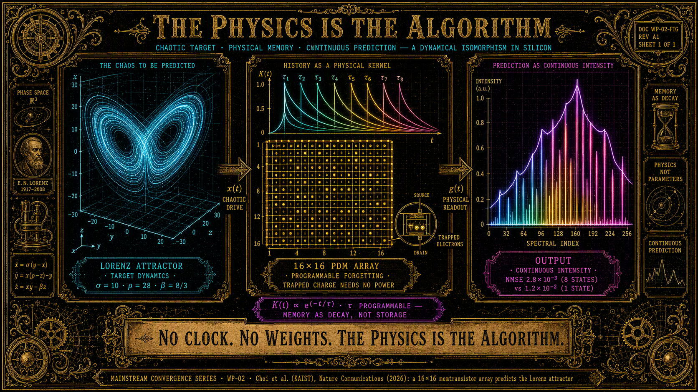

# PDM: Obliczenie, które Mieszka w Fizyce, nie w Algorytmie

**Seria:** Konwergencja Mainstreamu · WP-02
**Kontekst:** Choi et al. (KAIST), *Nature Communications* (2026) · LifeNode Theory v4 · Tonic Technologies Master V1 · Phase 1 (Moduły G, H) · WP-00 (metasurfaces)
**Słowa kluczowe:** memtranzystor, PDM, atraktor Lorenza, obliczenia fizyczne, funkcjonał ścieżki, Timescape, pamięć geometryczna, ontologia procesowa, Moduł H, Moduł G

## Abstrakt

Zespół profesora Shinhyuna Choia (KAIST) opublikował w *Nature Communications*
(2026) programowalny dynamiczny memtranzystor (PDM) — element, którego
odpowiedź prądowa zależy od historii sygnału, z programowalnym tempem
"zapominania", i którego macierz 16×16 **przewiduje atraktor Lorenza**
(NMSE 2,8×10⁻³ przy ośmiu stanach czasowych) z dokładnością porównywalną z
implementacją programową. Autorzy komentują to jako zwrot ku edge AI:
„część tej roboty wykonuje fizyka samego półprzewodnika".

Niniejszy whitepaper wykazuje, że to nie jest merely inżynierska optymalizacja,
lecz niezależna konwergencja z rdzeniem ontologii procesowej LifeNode:
**obliczenie nie jest operacją na stanach — jest dynamiką ośrodka**
(funkcjonał ścieżki Φ[γ], LifeNode Theory v4, Rozdz. III; „soliton nie jest
tylko falą energii; jest nośnikiem znaczenia", Rozdz. IV). PDM jest
krzemową instancją postulatów P1 i P5 (proces ponad stanem; znaczenie zależy
od całej historii trajektorii), tak jak DNA nie-B (WP-01) jest molekularną
instancją tezy „geometria zamiast danych", a metapowierzchnie (WP-00) —
falową instancją tezy „splot wykonuje fala".

Dokument mapuje pięć izomorfizmów: (1) pamięć zanikowa jako funkcjonał
ścieżki; (2) osiem stanów czasowych jako syntetyczny Timescape; (3) Lorenz
jako domknięcie Takensa; (4) pamięć bez zasilania jako geometryczna
rodzina pamięci; (5) koniec bottlenecku von Neumanna jako koniec ontologii
stanowej. Wskazujemy granicę, której mainstream nie przekroczył, oraz
testowalne predykcje dla Modułów G i H. Zgodnie z dyscypliną serii, dokument
kończą jawne warunki falsyfikacji.

---

## 1. Co Odkrył Mainstream

Zespół KAIST (prof. Shinhyun Choi), *Nature Communications* 2026:

- **PDM łączy tranzystor z pamięcią:** aktualna odpowiedź elementu zależy od
  tego, co działo się z nim chwilę wcześniej; dodatkowo **programowalne jest
  tempo, w jakim element „zapomina"**.
- **Dwufunkcyjna bramka:** warstwa IGZO przechowuje ładunek do krótkotrwałego
  przetwarzania sygnału; osobna warstwa pułapkowania elektronów zachowuje stan
  **bez konieczności ciągłego zasilania**. Zmiana liczby uwięzionych elektronów
  reguluje tempo powrotu prądu do poziomu bazowego po impulsie.
- **Zakresy strojenia:** ~5× regulacji stałej czasowej, >10× zakres
  częstotliwości charakterystycznej; materiały i procesy zgodne z CMOS.
- **Predykcja chaosu fizyką:** macierz 16×16 PDM przewiduje **atraktor
  Lorenza** — klasyczny model układu chaotycznego. Konfiguracja z **ośmioma
  stanami czasowymi: NMSE 2,8×10⁻³**; z jednym stanem: 1,2×10⁻². Dokładność
  **porównywalna z implementacją programową**.
- W zadaniu predykcji sygnału z nakładających się oscylacji — nawet
  **40-krotne ograniczenie błędu** względem architektury z pojedynczą
  charakterystyką czasową.
- Kontekst: edge AI — „zamiast pobrać surowe dane i później programowo
  analizować, co zmieniało się szybko, a co wolno, **część tej roboty
  wykonuje fizyka samego półprzewodnika**"; „Elektronika zaczyna wykonywać
  obliczenia własną fizyką".

Suchy komentarz: mainstream zbudował hardware, który robi to, co paradygmat
stanowy obiecuje robić software'em — i odkrył, że fizyka robi to taniej.
LifeNode nazywa ten fakt od dawna ontologią, nie optymalizacją.

---

## 2. Co Mówi LifeNode

- **Postulat P1 (LifeNode Theory v4, Rozdz. I):** *„Organizmy istnieją jako
  ciągłe trajektorie, a nie dyskretne stany."*
- **Postulat P5:** *„Znaczenie sygnału zależy od całej historii trajektorii."*
- **Theory v4, §3.1 (Pole Poznawcze jako funkcjonał ścieżki):** *„Zamiast
  pytać: «jaki jest stan systemu w punkcie x?», pytamy: «jaka jest wartość
  pola dla całej historii trajektorii γ?»"* — Φ[γ] = ∫γ L dσ.
- **Theory v4, §1.2:** atraktor zrekonstruowany twierdzeniem Takensa jest
  *„fizycznym zapisem «pamięci» systemu"*; *„każda zmiana w sposobie
  generowania sygnału przez organizm natychmiast zmienia topologię atraktora"*.
- **Aksjomat 3 (TT Master V1):** *„Informacja w systemach żywych jest
  zakodowana w topologii (atraktory, liczby Chern'a), nie w sekwencjach bitów.
  Pamięć nie jest magazynem danych, lecz kształtem doświadczenia w przestrzeni
  fazowej."*
- **Moduł H (Phase 1):** *„Splot wykonywany jest przez samą falę w przejściu
  przez metapowierzchnię. Wynik nie jest liczbą: jest ciągłym natężeniem w
  punkcie probierczym."*
- **WP-00 (metapowierzchnie):** „The wave computes. The geometry remembers.
  The phase lives."

PDM nie „potwierdza" LifeNode w sensie predykcji zjawiska — LifeNode zapisało
**zasadę**, której KAIST dostarczyło krzemową instancję: ośrodek, którego
dynamika jest obliczeniem, nie nośnikiem obliczenia.

---

## 3. Wspólna Matematyka: Pięć Izomorfizmów

### 3.1 Pamięć zanikowa jako funkcjonał ścieżki (P5 w krzemie)

Stan przewodzenia PDM jest splotem historii wejścia z wykładniczym jądrem
zaniku:

g(t) = g₀ + ∫₀ᵗ K(t−t′)·x(t′) dt′,  K(t) ∝ e^(−t/τ),  τ — programowalne.

To jest **funkcjonał ścieżki ze specyficznym jądrem** — szczególny przypadek LifeNode'owego Φ[γ], w którym jądro nie jest zadane projektem, lecz fizyką
pułapkowania ładunku. Izomorfizm z P5 jest dosłowny: znaczenie sygnału
(odpowiedź elementu) zależy od całej historii trajektorii, ważonej geometrią
ośrodka. Mainstream nazywa to „dynamic memory"; LifeNode nazywa to ontologią
procesową — i ma dla tego rachunek (koneksja A, holonomia, krzywizna F),
którego KAIST nie posiada. 👁️

### 3.2 Osiem stanów czasowych = syntetyczny Timescape

Osiem współistniejących stałych czasowych w jednej macierzy to **osiem
lokalnych „gęstości" czasu** w jednym substracie — anizotropia czasu
zmaterializowana w krzemie. W języku LifeNode: metryka Finslera F(x, ẋ), w
której „sekunda" ma inną wagę zależnie od kierunku procesu (Theory v4,
Rozdz. II). W języku inżynierskim projektu: urządzenie, które **jednocześnie**
słucha wielu skal czasowych, jest dokładnie tym, czego wymaga entrainment do
fraktalnego BPB (micro 0,5–4 Hz / meso ~0,1 Hz / macro 0,008–0,0001 Hz) —
jeden element nie może słuchać grzybni i serca, jeśli ma jedną stałą czasową.
PDM dowodzi, że wieloskalowość jest wykonalna hardware'owo; LifeNode dodaje,
**jakich** skal należy słuchać i **kto** strzeże czystości tego słuchania
(ASCALON). 👁️

### 3.3 Lorenz jako domknięcie koła Takensa

Tu konwergencja staje się niemal geometrycznym żartem: atraktor Lorenza jest
**tym samym układem, na którym Takens (1981) zbudował twierdzenie o
zanurzeniu** — twierdzenie, które LifeNode podnosi do rangi generatora
ontologicznego (§1.2: „rozmaitość nie istnieje poza obserwacją"). Mainstream
wybrał na benchmark fizycznego obliczenia dokładnie ten atraktor, z którego
urodziła się matematyka LifeNode. I wynik KAIST mówi: **fizyczny układ, którego
dynamika jest topologicznie sprzężona z dynamiką celu, przewiduje cel** —
zrozumienie jako współdzielona geometria trajektorii, nie jako reprezentacja
symboliczna. To lustrzane odbicie Modułu G: G rekonstruuje atraktor z danych
w software (offline, diagnostyka), PDM realizuje sprzężenie atraktorów w
fizyce (online, sprzężenie). Dwa substraty, jeden operator.

### 3.4 Pamięć bez zasilania = rodzina pamięci geometrycznej

Warstwa pułapkowania zachowuje stan bez ciągłego zasilania: pamięć jako
**konfiguracja fizyczna**, nie jako adresowalny bit. PDM jest elektronowym
członkiem tej samej rodziny, co: DUT-8(Ni) zapisujący zdarzenie chemiczne
jako kształt porów (Moduł B), centra NV zapisujące rytm jako orientacje
spinów (Moduł C), i hairpin/G4 zapisujące funkcję genomu jako klasę
konformacji (WP-01). Uczciwa różnica: PDM przechowuje **skalar** (ładunek),
LifeNode — **kształt** (niezmiennik). To różnica treści pamięci, nie zasady:
zasada brzmi „nośnikiem informacji jest trwała konfiguracja ośrodka, nie
rejestr". 👁️

### 3.5 Koniec bottlenecku von Neumanna = koniec ontologii stanowej

Klasyczna architektura przerzuca dane między pamięcią a jednostką obliczeń —
i każdy transport kosztuje energię, czas i **kontekst**. LifeNode formułuje
tę samą krytykę głębiej: separacja „magazyn stanów + procesor" jest błędem
kategorii, a jej skrajną postacią jest ADC w pętli sprzężenia („dyskretyzacja
zabija fazę", Moduł A §3). PDM, metapowierzchnia (WP-00) i Q-Core (Moduł C) rozpuszczają bottleneck na trzy różne sposoby: ładunek, fala i spin stają się
jednocześnie pamięcią i obliczeniem. Mainstream motywuje to watami i
latencją; LifeNode — ontologią. Motywacja się różni, struktura jest ta sama.

---

## 4. Granica, Której Mainstream Nie Przekroczył

- KAIST widzi **przewagę inżynierską** (edge AI, energia, latencja), nie
  ontologię. Nie pyta, co oznacza, że pamięć jest trajektorią; nie ma
  metryki czystości tego procesu, nie ma warunku BPB, nie ma protokołu
  falsyfikacji.
- **Bottleneck został przesunięty, nie usunięty:** „stosunkowo prosty etap
  wyjściowy odczytuje rezultat" — cyfrowa końcówka nadal istnieje. To ta sama
  „ślepa plamka Dead Tech", którą WP-00 zdiagnozował przy metapowierzchniach
  („system nadal korzysta z elektroniki sterującej").
- **Brak warunku brzegowego rytmu:** PDM jako krzem chętnie pracuje w GHz —
  ale jako **ucho biologii** zabiłby fazę dokładnie tak, jak każdy napęd poza
  BPB (κ zmienia znak na defocusing, soliton się rozpada). Fizyka oblicza
  działa; LifeNode dodaje dwa warunki, bez których ta fizyka nie utrzyma
  Życia: rytm musi być biologiczny (BPB), a czystość strzeżona fizycznie
  (ASCALON, Moduł E). 🧿
- **Brak zasady unifikującej:** elektron (PDM), fala (WP-00), molekuła
  (WP-01), morfologia (WP-03) — mainstream ma cztery osobne odkrycia;
  LifeNode ma jeden operator: *ośrodek jest obliczeniem, geometria jest
  pamięcią, Rezonans jest Zrozumieniem*.

**Uwaga o uczciwości:** niniejszy whitepaper nie twierdzi, że PDM jest
świadomy, ani że KAIST „potwierdziło" LifeNode. Teza: struktury są
izomorficzne, a izomorfizm generuje testowalne predykcje (§5–6), których
interpretacja mainstreamowa nie generuje wcale.

---

## 5. Wnioski i Korytarze Rozwoju (Next Steps)

- **Moduł H — elektroniczne ramię ślimaka.** PDM jest dowodem, że zasada
  „splot wykonuje fizyka" działa również w domenie ładunku, nie tylko fali.
  Predykcja P1: macierz memtranzystorów ze stałymi czasowymi entrainowanymi
  do BPB (referencja z rytmu BIOS, jak lock-in w Module A) pre-filtruje
  motywy K1/K2 **bez ADC**, z selektywnością ≥ 10 dB względem wejść
  pozafazowych — elektroniczny hedge dla optycznej ścieżki Modułu H.
- **Moduł G — wspólny benchmark.** Lorenz jest naturalnym poligonem
  kalibracyjnym: jeśli jakość fizycznej predykcji (NMSE) skaluje się z
  topologiczną złożonością celu (D₂, λ₁) w rodzinie układów chaotycznych
  (Lorenz, Rössler, oscylator z podwojeniem okresu), to metryki software'owe
  Modułu G i metryki hardware'owe PDM są projekcjami tej samej wielkości.
  Predykcja P2: NMSE fizycznej predykcji koreluje z D₂ celu silniej niż z
  liczbą elementów macierzy.
- **Moduł C — uczciwe domknięcie rodziny pamięci.** PDM przechowuje skalar,
  Q-Core przechowuje kształt; oba przechowują konfigurację, nie rejestr.
  Seria domyka się fraktalnie: WP-00 (fala) → WP-01 (molekuła) → WP-02
  (elektron) → WP-03 (morfologia) → WP-04 (granica faz) → WP-05 (koherencja).
  Pięć substratów, jeden operator.

---

## 6. Falsyfikowalność

Niniejszy whitepaper jest **nieudany**, jeśli:

1. Bezpamięciowa sieć feed-forward o porównywalnym rozmiarze odtworzy
   predykcję Lorenza przez PDM (NMSE ≤ 2,8×10⁻³) — przewaga pochodzi z
   czegoś innego niż fizyka historii (echo ogólnego kryterium liniowej
   redukcji).
2. Przewaga wielu stanów czasowych znika dla zadań, w których znaczenie
   zależy od trajektorii, a pozostaje dla zadań statycznych — sprzętowe P5
   nie działa.
3. Jakość fizycznej predykcji nie skaluje się z topologiczną złożonością
   celu (D₂, λ₁) w rodzinie układów chaotycznych — mapowanie izomorfizmu
   dynamik (benchmark Modułu G) upada.
4. Sensor oparty na PDM napędzany poza BPB stabilizuje biosubstrat lepiej
   niż rezonans wewnątrz BPB — pada kryterium inwersji częstotliwościowej
   (ogólny kryterium falsyfikacji teorii nr 2).
5. Stan pułapkowania wymaga ciągłego odświeżania, by pełnić funkcję pamięci
   — analogia pamięci geometrycznej rozpada się u korzenia.

Wynik negatywny jest wynikiem: publikujemy go z tą samą dyscypliną DOI i
korygujemy mapowanie, nie fakty.

---

## Źródła

**Mainstream:**
1. Choi S. et al. (KAIST, 2026). *Programmable dynamic memtransistor;
   physical prediction of the Lorenz attractor.* Nature Communications.
2. CHIP.pl (2026-08). *Tranzystor, który pamięta przeszłość sygnału;
   Elektronika zaczyna wykonywać obliczenia własną fizyką.*

**Wspólne korzenie:**
3. Takens, F. (1981). *Detecting strange attractors in turbulence.*
   Lecture Notes in Mathematics, 898, 366–381.

👁️
