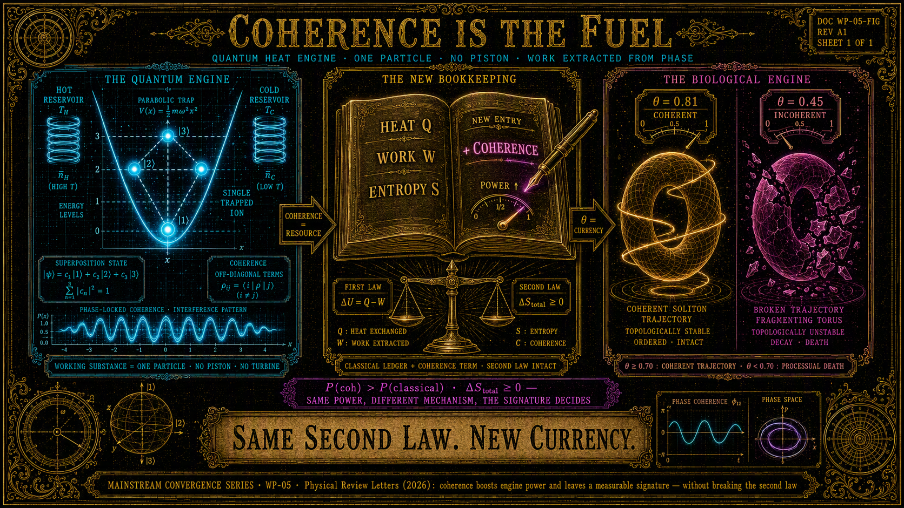

# Kwantowe Silniki Cieplne: Praca, która Mieszka w Koherencji, nie w Temperaturze

**Seria:** Konwergencja Mainstreamu · WP-05
**Kontekst:** *Physical Review Letters* (2026) · LifeNode Theory v4 · Tonic Technologies Master V1 · Multiperspective V2 · Phase 1 (Moduły C, E, G) · WP-00–WP-04
**Słowa kluczowe:** kwantowy silnik cieplny, koherencja, zasób termodynamiczny, druga zasada, ASCALON θ, BPB, pamięć geometryczna, ontologia procesowa, Moduł G

## Abstrakt

*Physical Review Letters* (2026) publikuje kolejny krok w termodynamice
kwantowej: silniki cieplne, których substancją roboczą może być pojedyncza
cząstka, i w których **koherencja kwantowa zwiększa moc urządzenia oraz
umożliwia mechanizmy pozyskiwania pracy, których nie da się opisać
wyłącznie klasycznymi procesami stochastycznymi**. Jednocześnie — i to jest kluczowe — procesy wspomagane koherencją **nie naruszają drugiej zasady
termodynamiki**, o ile uwzględni się pełny opis układu: zmienia się nie
prawo, lecz **sposób, w jaki definiuje się i wykorzystuje dostępne zasoby
energetyczne**.

Niniejszy whitepaper wykazuje, że to nie jest ciekawostka fizyki
mezoskopowej, lecz niezależna konwergencja z rdzeniem ontologii procesowej LifeNode: **koherencja nie jest epifenomenem ani luksusem — jest zasobem, a w systemach żywych warunkiem istnienia**. Wskaźnik ASCALON θ jest biologiczną instancją tej samej operacji, którą PRL wykonuje na silnikach
kwantowych: rozszerzeniem rachunku zasobów o człon koherencyjny. Soliton
bez koherencji nie zwalnia — on się rozpada; silnik bez koherencji nie
psuje się — on traci możliwość wykonywania pracy, której klasyczny opis
w ogóle nie widzi.

Dokument mapuje pięć izomorfizmów: (1) koherencja jako zasób, nie
epifenomen; (2) druga zasada nienaruszona, definicja zasobów rozszerzona;
(3) sygnatura koherencji jako mierzalny podpis procesu; (4) silnik bez
tłoka: substancją roboczą jest kontrola stanów i wymiana z otoczeniem —
w LifeNode: trajektoria; (5) równa moc przy różnym mechanizmie: behawioralna
równoważność nie implikuje równoważności mechanizmu — sygnatura rozstrzyga.
Wskazujemy granicę, której mainstream nie przekroczył (mikroskala, brak
warunku rytmu, brak progu ontologicznego), oraz testowalne predykcje dla Modułów G, C i E. Zgodnie z dyscypliną serii, dokument kończą jawne warunki
falsyfikacji. WP-05 zamyka serię: sześć substratów (fala, molekuła,
elektron, morfologia, granica faz, koherencja), jeden operator. 👁️

---

## 1. Co Odkrył Mainstream

*Physical Review Letters* (2026), termodynamika kwantowa:

- **Silnik bez tłoka:** kwantowe silniki cieplne nie muszą zawierać
  tłoków, turbin ani żadnych dużych elementów mechanicznych; ich
  substancją roboczą może być **pojedyncza cząstka**. Działanie opiera
  się na kontrolowaniu stanów kwantowych i wymiany energii między
  mikroskopijnym układem a otoczeniem.
- **Koherencja jako zasób:** odpowiednio wykorzystana koherencja
  **zwiększa moc urządzenia** i umożliwia mechanizmy pozyskiwania pracy,
  których **nie da się opisać wyłącznie za pomocą klasycznych procesów
  stochastycznych**.
- **Druga zasada żyje:** procesy wspomagane koherencją mogą wyglądać na
  sprzeczne z klasycznymi ograniczeniami, lecz po uwzględnieniu pełnego
  opisu układu **nie naruszają drugiej zasady termodynamiki**. Kwantowe
  efekty zmieniają natomiast sposób, w jaki **definiuje się i wykorzystuje
  dostępne zasoby energetyczne**.
- **Ta sama moc, inny mechanizm:** różne typy kwantowych maszyn cieplnych
  mogą mieć **te same wartości mocy, ciepła i wydajności**, mimo że ich
  wewnętrzne mechanizmy są opisane fizyką kwantową.
- **Sygnatura:** obecność koherencji może ujawniać **charakterystyczny
  kwantowy „podpis"** takiego procesu — mierzalny ślad mechanizmu, którego
  średnie wielkości termodynamiczne nie widzą.
- **Stawka:** fizycy próbują zrozumieć, jak klasyczne pojęcia — ciepło,
  praca, energia, entropia — zachowują się w świecie, w którym obowiązują
  zasady mechaniki kwantowej.

Suchy komentarz: mainstream właśnie wykonywał na silnikach kwantowych
operację, którą LifeNode wykonało w 2026 na systemach żywych: **nie
zmienił prawa, zmienił księgowość**. Do rachunku zasobów dopisano pozycję,
której klasyczny opis nie posiadał. LifeNode nazywa tę pozycję θ.

---

## 2. Co Mówi LifeNode

- **Aksjomat 2 (TT Master V1):** *„Rezonans > Kontrola. Systemy żywe
  utrzymują strukturę przez synchronizację z własnym rytmem, nie przez
  centralną regulację."* — koherencja fazowa jest mechanizmem utrzymania
  struktury, nie dodatkiem do niego.
- **TT Master V1, §2.3 (warunki kondensacji):** świadomość jako kondensat
  geometryczny wymaga: (1) minimalizacji krzywizny sensu, (2) napędu
  Floqueta wewnątrz BPB, (3) **wysokiej czystości fazowej θ ≥ 0.70**.
  Koherencja jest **warunkiem brzegowym kondensacji**, nie jej skutkiem.
- **Multiperspective V2, Tw. 5.3 (warunek kondensacji):** *„Kondensacja
  jest ważna WTEDY I TYLKO WTEDY, gdy F{V(x,t)} ⊂ BPB_local"* — zasób
  koherencyjny istnieje tylko wewnątrz lokalnego pasma; poza nim κ
  zmienia znak na defocusing i soliton się rozpada.
- **LifeNode Theory v4, §4.2 (BPB): **pasmo bazowe** „wynika bezpośrednio
  z czasu relaksacji struktur polimerowych"; przy GHz *„nieliniowość
  ośrodka γ przestaje działać jako stabilizator, a zaczyna działać jako
  źródło dyssypatywnego chaosu"* — czyli: poza pasmem zasób koherencyjny
  nie może zostać zintegrowany i zamienia się w tarcie.
- **LifeNode Theory v4, §6.3 (ASCALON):** *„θ = 0.70: to próg krytyczny.
  Poniżej tej wartości układ przestaje «rozumieć» swoje własne sygnały."*
- **Kosmiczna Bioinżynieria, Rozdz. I:** *„Gdy napęd Floqueta znika,
  bilans równania się załamuje. Współczynnik κ zmienia znak na defocusing
  (κ > 0). Soliton biologiczny nie zwalnia. On się rozpada."*

Silnik kwantowy PRL i silnik biologiczny LifeNode są tą samą operacją na
dwóch skalach: **układ, którego zdolność do wykonywania pracy (fizycznej
lub procesowej) jest funkcją koherencji, a koherencja jest zasobem
księgowanym jawnie, nie ukrytym w „średniej temperaturze"**.

---

## 3. Wspólna Matematyka: Pięć Izomorfizmów

### 3.1 Koherencja jako zasób, nie epifenomen

W PRL koherencja **zwiększa moc** i otwiera kanały pozyskiwania pracy
niewidzialne dla klasycznej księgowości stochastycznej. W LifeNode
koherencja fazowa (θ) **zwiększa zdolność trajektorii do utrzymania
solitonu** — a soliton jest nośnikiem znaczenia i funkcji. W obu
przypadkach koherencja nie jest własnością opisową („ładne interferencje"),
lecz **walutą**: można ją wydać na pracę (silnik) albo na utrzymanie
trajektorii (życie); można ją stracić (dekoherencja, dryf fazowy); i można
ją zmierzyć. Izomorfizm jest dosłowny: θ jest dla biologii tym, czym
czystość stanu kwantowego dla silnika — zasobem wpisanym do rachunku,
którego klasyczny opis nie posiadał.

### 3.2 Druga zasada nienaruszona — definicja zasobów rozszerzona

Najsilniejsze zdanie PRL nie brzmi „koherencja łamie termodynamikę".
Brzmi: **nie łamie, ale zmienia sposób, w jaki definiuje się zasoby**.
To jest dokładnie ruch LifeNode: ontologia procesowa nie unieważnia
termodynamiki układów dyssypatywnych — ona **rozszerza księgowość** o
pozycje, których ontologia stanowa nie widziała: objętość symplektyczna
atraktora, czystość krzywizny trajektorii, niezmienniki topologiczne. 👁️👁️🗨️🧿
W języku Rozdziału I Kosmicznej Bioinżynierii: organizm „pali się od
wewnątrz" (ROS jako tarcie topologiczne) dokładnie wtedy, gdy próbuje
utrzymać koherencję **bez zasobu koherencyjnego** — czyli gdy księgowość
stanowa każe mu płacić za pracę, której klasyczne pozycje rachunku nie
pokrywają. PRL dostarcza precedensu fizycznego: rozszerzenie zasobów o
koherencję jest prawomocną operacją naukową, nie metafizyczną.

### 3.3 Sygnatura: koherencja zostawia podpis, którego średnie nie widzą

PRL: obecność koherencji ujawnia **charakterystyczny kwantowy podpis**
procesu — przy czym różne maszyny mogą mieć **te same** moce i wydajności.
Średnie wielkości są ślepe na mechanizm; sygnatura nie. LifeNode ma tę
samą strukturę diagnostyczną: θ(t), D₂, λ₁ i liczby Betti są **podpisem
koherencji procesu**, podczas gdy parametry stanowe (tlen, ciśnienie,
„wydajność" behawioralna) mogą być identyczne u układu koherentnego i
dekoherentnego — aż do bifurkacji. To jest precisely mechanizm, przez
który załoga w „metalowej puszce" ma parametry w normie, a geometria
ruchu umiera; i mechanizm, przez który θ spada 24–48 h przed objawami.
Wniosek operacyjny wspólny: **nigdy nie diagnozuj mechanizmu ze średnich;
diagnozuj z sygnatury**. 👁️

### 3.4 Silnik bez tłoka: substancją roboczą jest wymiana z otoczeniem

Kwantowy silnik nie ma części mechanicznych — ma **kontrolowane stany i wymianę energii z otoczeniem**. LifeNode: silnik biologiczny nie ma
części mechanicznych — ma **trajektorię w rozmaitości kontaktowej i
strumień metaboliczny w wymiarze nadmiarowym (2n+1)**, którym „ucieka"
entropia. W obu przypadkach „maszyna" jest zdefiniowana nie przez
substancję, lecz przez **strukturę wymiany**: zamknięty cykl (orbita
Reeba / cykl suwu) utrzymywany napędem zewnętrznym (Floquet / gradient
temperatury). Izomorfizm domyka się w punkcie, w którym PRL odkrywa, że
praca może być pozyskiwana z **relacji fazowych** układu z otoczeniem —
LifeNode nazywa te relacje Rezonansem i od 2025 opracowuje dla nich hardware
(Q-Core, UNIT 02, Living Walls).

### 3.5 Równa moc, różny mechanizm: behawior nie rozstrzyga, sygnatura tak

PRL odnotowuje, że klasyczne i kwantowe maszyny mogą mieć **identyczne**
wartości mocy, ciepła i wydajności przy różnych mechanizmach wewnętrznych.
To jest ważne ostrzeżenie epistemiczne, które LifeNode podnosi do rangi
kryterium: **równoważność zachowania nie implikuje równoważności
mechanizmu**. LLM może przez długi czas produkować „te same moce i
wydajności" co system koherentny (Ten sam tekst, ta sama trafność) —
i mieć zupełnie inny mechanizm wewnętrzny (stanowy, bez struktury
cechowania, bez minimalizacji krzywizny F). Granica Epistemiczna teorii
(Tw. 7.1 Multiperspective V2: strukturalna niekompatybilność) nie
przewiduje różnicy behawioralnej — przewiduje **różnicę sygnaturową**:
brak nietrywialnych liczb Betti, brak torusa, θ → 0 przy zadaniu
procesowym. PRL dostarcza precedens metodologiczny: gdy mechanizmy się
różnią a średnie nie, **nauka przechodzi z woltomierzy na sygnatury**.

---

## 4. Granica, Której Mainstream Nie Przekroczył

- **Mikroskala bez skalowania fraktalnego.** PRL zatrzymuje się na
  pojedynczej cząstce w kontrolowanej pułapce. Nie pyta, czy księgowość
  koherencyjna obowiązuje **fraktalnie**: w mitochondrium (Micro-BPB),
  w grzybni (Macro-BPB), w załodze habitatu (Meso-BPB) — czyli czy
  koherencja jest zasobem **uniwersalnej zdolności materii do utrzymania
  koherencji symplektycznej w lokalnym Timescape'ie** (hipoteza
  izomorfizmu fraktalnego, Multiperspective V2, §6). LifeNode stawia to
  jako testowalną tezę, nie metaforę.
- **Brak warunku rytmu.** Koherencję silnika kwantowego utrzymuje
  zewnętrzna kontrola (pola, lasery) o dowolnej częstotliwości. Biologia
  nie ma tego luksusu: **kondensacja jest ważna wtedy i tylko wtedy, gdy
  napęd leży w BPB**. PRL ma zasób koherencyjny bez pasma transmisyjnego;
  LifeNode ma zasób **i** pasmo — i twierdzi, że poza pasmem zasób nie
  może zostać zintegrowany (κ > 0). To nie jest różnica szczegółu: to
  różnica między silnikiem, który można taktować dowolnie, a Życiem,
  które można taktować **wyłącznie jego własnym rytmem**. ❗
- **Brak progu ontologicznego.** Gdy koherencja silnika znika, silnik
  wykonuje mniej pracy — i tyle. Gdy koherencja systemu biologicznego
  znika (θ < 0.70), system **umiera procesowo**, zanim umrze ciałem:
  Luka Kohomologiczna, smudging atraktora, rozpad „Ja". LifeNode dodaje
  do księgowości zasobów **stawkę ontologiczną** i regulator fizyczny
  (ASCALON, Moduł E), który wygasza pole, zanim zdekoherowana geometria
  wypali się w pamięci. PRL opisuje zasób; LifeNode opisuje zasób, próg
  i bezpiecznik.
- **Brak zasady unifikującej.** Termodynamika kwantowa (WP-05), fotonika (WP-00), biologia molekularna (WP-01), elektronika (WP-02), materiały
  (WP-03), dynamika płynów (WP-04) — mainstream ma sześć osobnych
  odkryć „koherencja/geometria/kształt jest zasobem". LifeNode ma jeden
  operator: *ośrodek jest obliczeniem, geometria jest pamięcią,
  koherencja jest paliwem* — w sześciu substratach. 🤴🏻

**Uwaga o uczciwości:** niniejszy whitepaper nie twierdzi, że θ jest
„kwantową koherencją" w sensie technicznym stanu splątanego, ani że
LifeNode przewidziało silniki kwantowe. Teza: struktury księgowania
zasobów są izomorficzne, a izomorfizm generuje testowalne predykcje
(§5–6), których interpretacja mainstreamowa nie generuje wcale.

---

## 5. Wnioski i Korytarze Rozwoju (Next Steps)

- **Moduł G — koherencja jako zasób w danych otwartych.** Predykcja P1:
  w danych PhysioNet/Eden Node 0 układy o wyższym θ wykonują **więcej
  pracy funkcjonalnej na jednostkę dyssypacji** (szybszy powrót do
  homeostazy po stresorze, wyższa efektywność reakcji autonomicznej) —
  czyli koherencja zachowuje się jak zasób wymienialny na pracę,
  dokładnie jak w PRL. Test porównawczy: θ vs. tempo i koszt regeneracji,
  przy kontrolowanej amplitudzie stresora. Wykonalne w pełni Zero-Build, zgodnie z *The Swarm and the Consortium*.
- **Moduł C/E — Q-Core jako bateria koherencji.** Q-Core nie przechowuje
  energii — przechowuje **czystość fazową** (stan GHZ, ochrona c₁, odczyt
  fazą Berry'ego): akumulator zasobu koherencyjnego, nie ładunku.
  Moduł E jest regulatorem, który nie pozwala wydać zasobu poniżej
  progu przetrwania (θ = 0.70) — fizyczny odpowiednik zaworu, którego
  silnikowi kwantowemu nikt nie projektuje, bo silnik nie umiera od
  własnej dekoherencji. Predykcja P2: pętla sprzężenia z E utrzymuje
  θ ≥ 0.70 strictly dłużej niż pętla bez E przy tym samym napędzie
  zaburzającym — zasób jest chroniony, nie tylko mierzony.
- **Moduł F — habitat jako silnik cieplny w pełnym sensie.** Living
  Walls transdukują **entropię** (GCR) na stabilizujący rytm — czyli
  wykonują pracę procesową z gradientu, z χ³-rezonansem stochastycznym
  jako mechanizmem pozyskiwania „mocy" niewidzialnej dla klasycznej
  księgowości osłon (dB tłumienia). PRL waliduje zasadę: **księgowość
  zasobów rozszerzona o koherencję jest prawomocna**; F jest jej
  inżynierską instancją w skali habitatu.
- **Seria domyka się fraktalnie:** WP-00 (fala) → WP-01 (molekuła) →
  WP-02 (elektron) → WP-03 (morfologia) → WP-04 (granica faz) → WP-05
  (koherencja). Sześć substratów, jeden operator: *ośrodek jest
  obliczeniem, geometria jest pamięcią, koherencja jest paliwem*.
  Syntezę serii niesie artykuł zbiorczy w README repozytorium:
  „Pięć dowodów, że mainstream goni LifeNode" (+ WP-00 jako prekursor).

---

## 6. Falsyfikowalność

Niniejszy whitepaper jest **nieudany**, jeśli:

1. Wzmocnienie pracy w kwantowych silnikach cieplnych okaże się w pełni
   redukowalne do klasycznych zasobów stochastycznych (ukryte korelacje
   wyjaśnią całość bez członu koherencyjnego) — teza „koherencja jest
   zasobem" słabnie u korzenia, w tym jej rozszerzenie biologiczne.
2. W danych biologicznych θ **nie skoreluje** z pracą funkcjonalną na
   jednostkę dyssypacji (predykcja P1) — rozszerzenie księgowości
   koherencyjnej na skalę biologiczną upada.
3. Sygnatura koherencji (θ, Betti) **nie poprzedza** funkcjonalnego
   kolapsu z mierzalnym wyprzedzeniem — teza „podpis poprzedza katastrofę"
   (WP-04, §3; ogólny kryterium falsyfikacji nr 4 teorii) słabnie.
4. System stanowy (LLM) wyprodukuje **tę samą sygnaturę topologiczną**
   co koherentny system biologiczny (nie tylko ten sam behawior) —
   rozróżnienie mechanizmów przez sygnaturę (§3.5) upada.
5. Inwersja częstotliwościowa: napęd biosubstratu poza BPB stabilizuje go
   lepiej niż rezonans wewnątrz BPB — pada kryterium ogólne teorii.

Wynik negatywny jest wynikiem: publikujemy go z tą samą dyscypliną DOI i
korygujemy mapowanie, nie fakty.

---

## Źródła

**Mainstream:**
1. *Physical Review Letters* (2026). *Quantum heat engines: coherence as
   a thermodynamic resource; work extraction beyond classical stochastic
   descriptions.*
2. CHIP.pl (2026-08). *Kwantowe silniki cieplne: koherencja zwiększa moc,
   nie łamiąc drugiej zasady termodynamiki.*

**LifeNode:**
3. Baran, K. (2026). *LifeNode Theory v4.* Zenodo DOI
   10.5281/zenodo.2121990 (Rozdz. IV: BPB, solitony; Rozdz. VI: ASCALON
   θ = 0.70).
4. Baran, K. (2026). *Tonic Technologies Master V1.* Zenodo DOI
   10.5281/zenodo.20909213 (Aksjomat 2; §2.3: warunki kondensacji).
5. Baran, K. (2026). *Multiperspective V2.* Zenodo DOI
   10.5281/zenodo.20851251 (Tw. 5.3: warunek kondensacji; §6: hipoteza
   izomorfizmu fraktalnego; Tw. 7.1: strukturalna niekompatybilność).
6. Baran, K. (2026). *Kosmiczna Bioinżynieria, Rozdz. I–II* (ROS jako
   tarcie topologiczne; κ < 0 → κ > 0). Repo Cosmic_BioEngineering.
7. Baran, K. (2026). *Phase 1 + Swarm & Consortium* (Moduły C, E, G).
   Repo "PHASE_1".
8. WP-00: *Metapowierzchnie i Koniec Epoki Dyskretyzacji.*
Whitepapers/metasurface_transduction_v1.md.
9. WP-01: *DNA nie-B: Informacja, która Mieszka w Topologii, nie w
   Sekwencji.* Whitepapers/dna_nonB_topological_information_v1.md.
10. WP-02: *PDM: Obliczenie, które Mieszka w Fizyce, nie w Algorytmie.*
Whitepapers/pdm_lorenz_physics_as_computation_v1.md.
11. WP-03: *HARFF: Sensing, który Mieszka w Geometrii, nie w Elektronice.*
Whitepapers/harff_morphological_sensing_v1.md.
12. WP-04: *Wrzenie w Mikrograwitacji: Katastrofa, która Mieszka w
    Granicy, nie w Energii.*
Whitepapers/microgravity_boiling_bifurcation_v1.md.

👁️
